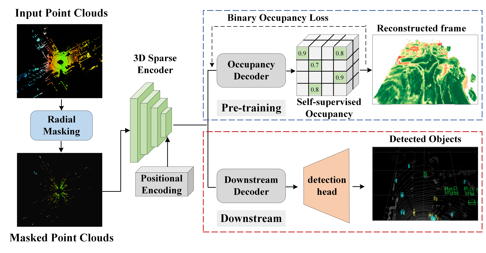

<div align='center'>
 
# Sense Less, Generate More: Pre-training LiDAR Perception with Masked Autoencoders for Ultra-Efficient 3D Sensing

[Sina Tayebati](https://github.com/sinatayebati)<sup></sup>&nbsp;&nbsp;&nbsp;
[Theja Tulabandhula](https://theja.org/)<sup></sup>&nbsp;&nbsp;&nbsp;
[Amit R. Trivedi](https://scholar.google.com/citations?user=Thpd0HkAAAAJ&hl=en&oi=ao)<sup></sup>&nbsp;&nbsp;&nbsp;

<div>
<sup></sup> University of Illinois Chicago
</div>

<br/>

[](https://arxiv.org/abs/2406.07833) 
[]()

</div>

If you find this work or code useful, please cite our [paper](https://arxiv.org/abs/2406.07833) and [give this repo a star](https://github.com/sinatayebati/R-MAE.git):

```
@article{tayebati2024sense,
    title={Sense Less, Generate More: Pre-training LiDAR Perception with Masked Autoencoders for Ultra-Efficient 3D Sensing},
    author={Sina Tayebati and Theja Tulabandhula and Amit R. Trivedi},
    journal={arXiv preprint arXiv:2406.07833},
    year={2024},
}
```

<!-- <p align="center">
    
</p> -->


# Table of Content
- [News](#news) 
- [1. Installation](#1-installation)
- [2. Data Preparation](#2-data-preparation)
- [3. Training and Evaluation](#3-training-and-evaluation)
- [4. Performance Benchmarks](#4-performance-benchmarks)

# News
- 04/14/2024: Code released for pre-training R-MAE.
- 06/12/2024: Paper released on [arXiv](https://arxiv.org/abs/2406.07833)!

# 1. Installation

1. Download the source code with git
      ```
      git clone https://github.com/sinatayebati/R-MAE.git
      ```
2. Create conda environment with essential packages:
      ```
      bash env-scripts/setup.sh
      conda activate r-mae
      ```
      ```
      pip install requirements.txt
      pip install spconv-cu113
      ```
      ```
      python setup.py develop
      ```

> [!TIP]
> If you are familiar with Docker, we recommend you to use the Docker container for stable and hassle free enironment management for this project. Docker files are available under `docker` directory.

In case of any issues, please refer to [INSTALL.md](docs/INSTALL.md) for the installation of [OpenPCDet(v0.6)](https://github.com/open-mmlab/OpenPCDet).

# 2. Data Preparation

Please refer to [GETTING_STARTED.md](docs/GETTING_STARTED.md) for detailed documentation.

> [!CAUTION]
> For Waymo, please make sure to download `v.1.2` otherwise you will face evaluation issues.

# 3. Training and Evaluation

## 3.1. Pre-training R-MAE

### KITTI:

* Pretrain with multiple GPUs:
```shell
bash ./scripts/dist_train_mae.sh ${NUM_GPUS} \
  --cfg_file cfgs/kitti_models/radial_mae_kitti.yaml
```
* Pretrain with a single GPU:
```shell
python3 train_ssl.py ${NUM_GPUS} \
  --cfg_file cfgs/kitti_models/radial_mae_kitti.yaml --batch_size ${BATCH_SIZE}
```

### Waymo:

```shell
bash ./scripts/dist_train_mae.sh ${NUM_GPUS} \
  --cfg_file cfgs/waymo_models/radial_mae_waymo.yaml
```

### nuScenes:

```shell
bash ./scripts/dist_train_mae.sh ${NUM_GPUS} \
  --cfg_file cfgs/nuscenes_models/radial_mae_res_nuescenes.yaml
```

> [!NOTE]
> If you want to pre-train the range aware R-MAE, set your yaml config to run the backbone `radial_mae_ra.py`. Otherwise, if you just want to play with angular ranges, set to run the backbone `radial_mae.py`.
> For pre-training on nuScene, you must set your config to run `radial_mae_res.py`.

## 3.2. Finetuning

Finetune with multiple GPUs:
* example of fintetuning R_MAE checkpoint on Waymo using PVRCNN
```shell
bash ./scripts/dist_train.sh ${NUM_GPUS} \
  --cfg_file cfgs/waymo_models/pv_rcnn.yaml \
  --pretrained_model ../output/waymo_models/radial_mae_waymo/default/ckpt/checkpoint_epoch_30.pth
```

## 3.3. Evaluation
 By default, scripts are set to evaluate the last 5 checkpoints of each training. However, in case you need to evaluate specific checkpoint, use the following sample:

```shell
bash scripts/dist_test.sh ${NUM_GPUS} \
 --cfg_file  cfgs/waymo_models/voxel_rcnn_with_centerhead_dyn_voxel.yaml \
 --ckpt ../output/waymo_models/voxel_rcnn_with_centerhead_dyn_voxel/default/ckpt/checkpoint_epoch_30.pth
```

# 4. Performance Benchmarks

### KITTI 3D Dataset

Performance comparison on the kitti val split evaluated by the ap with 40 recall positions at moderate difficulty level.

|                                             | Car@R40 | Pedestrian@R40 | Cyclist@R40  | download | 
|---------------------------------------------|:-------:|:--------------:|:------------:|:--------:|
| [SECOND](tools/cfgs/kitti_models/second.yaml)       | 79.08 | 44.52 | 64.49 |
| [SECOND + R-MAE [0.8 mr]](tools/cfgs/kitti_models/second.yaml)       | 79.64 | 47.33 | 65.65 | [ckpt]() |
| [SECOND + R-MAE [0.9 mr]](tools/cfgs/kitti_models/second.yaml)       | 79.10 | 46.93 | 67.75 | [ckpt]() |
| [PV-RCNN](tools/cfgs/kitti_models/pv_rcnn.yaml) | 82.28 | 51.51 | 69.45 |
| [PV-RCNN + R-MAE [0.8 mr] ](tools/cfgs/kitti_models/pv_rcnn.yaml) | 83.00 | 52.08 | 71.16 | [ckpt]() |
| [PV-RCNN + R-MAE [0.9 mr] ](tools/cfgs/kitti_models/pv_rcnn.yaml) | 82.82 | 51.61 | 73.82 | [ckpt]() |


Performance Comparison of R-MAE Variations with 80% Masking and Angular Ranges of 1°, 5°, and 10° Fine-Tuned on SECOND, Evaluated on KITTI Validation Split by AP with 40/11 Recall Positions at Moderate Difficulty Level"


|                                             | Car @40/@R11 | Pedestrian @40/@R11 | Cyclist @40/@R11  | download | 
|---------------------------------------------|:-------:|:--------------:|:------------:|:--------:|
| [SECOND](tools/cfgs/kitti_models/second.yaml)       | 79.08/77.81 | 44.52/46.33 | 64.49/63.65 |
| [SECOND + R-MAE [0.8 mr + 1 degree] ](tools/cfgs/kitti_models/second.yaml)       | 79.64/78.23 | 47.33/48.70 | 65.65/65.72 | [ckpt]() |
| [SECOND + R-MAE [0.8 mr + 5 degree] ](tools/cfgs/kitti_models/second.yaml)       | 79.38/78.05 | 46.81/48.00 | 63.62/64.48 | [ckpt]() |
| [SECOND + R-MAE [0.8 mr + 10 degree]](tools/cfgs/kitti_models/second.yaml)       | 79.41/78.04 | 46.23/47.57 | 65.18/65.21s | [ckpt]() |


Results of domain adaption on KITTI validation split by AP with 40 recall positions at moderate difficulty level. Pretraining was performed on %90 masking.

|                                             | Car @40 | Pedestrian @40 | Cyclist @40  | download | 
|---------------------------------------------|:-------:|:--------------:|:------------:| :--------:|
| [SECOND](tools/cfgs/kitti_models/second.yaml)       | 79.08 | 44.52 | 64.49 |
| [+ waymo -> kitti](tools/cfgs/kitti_models/second.yaml)       | 79.30 | 48.61 | 66.62 |  [ckpt]() |
| [+ nuscene -> kitti](tools/cfgs/kitti_models/second.yaml)       | 79.32 | 46.05 | 68.27 |  [ckpt]() |

> [!NOTE]
> Our results for SOTA models (i.e socond, pvrcnn) are reproduced by us and you will find slight difference in our results compared to released benchmarks of OpenPCDet due to slight differences in evaluation metrics.


### Waymo Open Dataset

All models are trained with **a single frame** of **20% data (~32k frames)** of all the training samples on 2 RTX 6000 ADA GPUs, and the results of each cell here are mAP/mAPH calculated by the official Waymo evaluation metrics on the **whole** validation set (version 1.2).    

|    Performance@(train with 20\% Data)            | Vec_L1 | Vec_L2 | Ped_L1 | Ped_L2 | Cyc_L1 | Cyc_L2 |  
|---------------------------------------------|----------:|:-------:|:-------:|:-------:|:-------:|:-------:|
[CenterPoint]()| 71.33/70.76|63.16/62.65|	72.09/65.49	|64.27/58.23|	68.68/67.39	|66.11/64.87|
| [CenterPoint + R-MAE](tools/cfgs/waymo_models/centerpoint.yaml)| 73.38/72.85 | 65.28/64.79	| 74.84/68.68	| 66.90/61.24 |	72.05/70.84	| 69.43/68.26 |
| [Voxel R-CNN (CenterHead)-Dynamic-Voxel]() | 76.13/75.66	|68.18/67.74	|78.20/71.98	|69.29/63.59	| 70.75/69.68	|68.25/67.21|
| [Voxel R-CNN (CenterHead)-Dynamic-Voxel + R-MAE](tools/cfgs/waymo_models/voxel_rcnn_with_centerhead_dyn_voxel.yaml) | 76.35/75.88	| 67.99/67.56 | 78.60/72.56	| 69.93/64.35	| 71.74/70.65	| 69.13/68.08 |
| [PV-RCNN]() | 75.41/74.74	|67.44/66.80	|71.98/61.24	|63.70/53.95	|65.88/64.25	|63.39/61.82 |
| [PV-RCNN + R-MAE](tools/cfgs/waymo_models/pv_rcnn_with_centerhead_rpn.yaml) | 76.72/76.22 |	68.38/67.92|	78.19/71.74 | 69.63/63.68 | 72.44/70.32	|	68.84/67.76|


Here we also provide the performance of several models trained and finetuned on 100% training set while pretraining has been the same on 20% of the data:


| Performance@(train with 100\% Data)                                                       | Vec_L1 | Vec_L2 | Ped_L1 | Ped_L2 | Cyc_L1 | Cyc_L2 |  
|-------------------------------------------------------------------------------------------|----------:|:-------:|:-------:|:-------:|:-------:|:-------:|
| [PV-RCNN (CenterHead)](tools/cfgs/waymo_models/pv_rcnn_with_centerhead_rpn.yaml)          | 78.00/77.50 | 69.43/68.98 | 79.21/73.03 | 70.42/64.72 | 71.46/70.27 | 68.95/67.79 |
| [PV-RCNN (CenterHead + R-MAE)](tools/cfgs/waymo_models/pv_rcnn_with_centerhead_rpn.yaml)          | 78.10/77.65 | 69.69/69.25 | 79.61/73.69 | 71.26/65.72 | 71.94/70.87 | 69.32/68.28 |

> [!NOTE]
> Due to licence agreement of Waymo Open Dataset, we are not allowed to release the checkpoints.


### nuScenes Dataset 

All models are trained with 2 RTX 6000 ADA GPUs and are available for download.

|                                                                                                    | Modality |  mATE |  mASE  |  mAOE  | mAVE  | mAAE  |  mAP  |  NDS   |                                              download                                              | 
|----------------------------------------------------------------------------------------------------|----------|------:|:------:|:------:|:-----:|:-----:|:-----:|:------:|:--------------------------------------------------------------------------------------------------:|
| [CenterPoint](tools/cfgs/nuscenes_models/cbgs_voxel01_res3d_centerpoint.yaml)     | LiDAR    | 30.11 | 25.55  | 38.28  | 21.94 | 18.87 | 56.03 | 64.54  |  [model-34M](https://drive.google.com/file/d/1Cz-J1c3dw7JAWc25KRG1XQj8yCaOlexQ/view?usp=sharing)   |
| [CenterPoint + R-MAE](tools/cfgs/nuscenes_models/cbgs_voxel01_res3d_centerpoint.yaml) | LiDAR    | 29.73 | 25.71  | 34.16  | 20.02 | 17.91 | 59.20 | 66.85  |  [ckpt]()   |
| [TransFusion-L](tools/cfgs/nuscenes_models/transfusion_lidar.yaml) | LiDAR    | 27.96 | 25.37 | 29.35 | 27.31 | 18.55 | 64.58 | 69.43  | [model-32M]() |
| [TransFusion-L + R-MAE](tools/cfgs/nuscenes_models/transfusion_lidar.yaml) | LiDAR    | 28.19 | 25.20  | 26.92  | 24.27 | 18.71 | 65.01 | 70.17  | [ckpt]() |
| [BEVFusion](tools/cfgs/nuscenes_models/bevfusion.yaml)     | LiDAR + Camera    |  28.26  |  25.43  |  28.88  |  26.80  | 18.67  |  65.91  |  70.20  | [model-157M]() |
| [BEVFusion + R-MAE](tools/cfgs/nuscenes_models/bevfusion.yaml)                                | LiDAR + Camera    |  28.31  |  25.54  |  29.57  |  25.87  | 18.60  |  66.40  |  70.41  | [ckpt]() |


##  License
Our codes are released under the Apache 2.0 license.

## Acknowledgement

This project is mainly based on the following codebases. Thanks for their great works!

* [OpenPCDet](https://github.com/open-mmlab/OpenPCDet)
* [SPCONV](https://github.com/traveller59/spconv)

